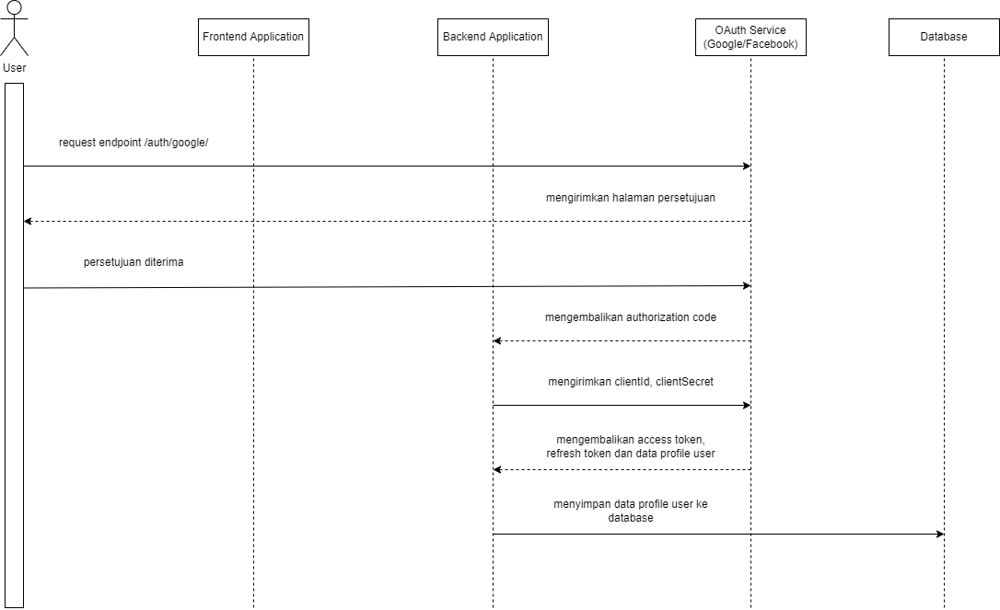
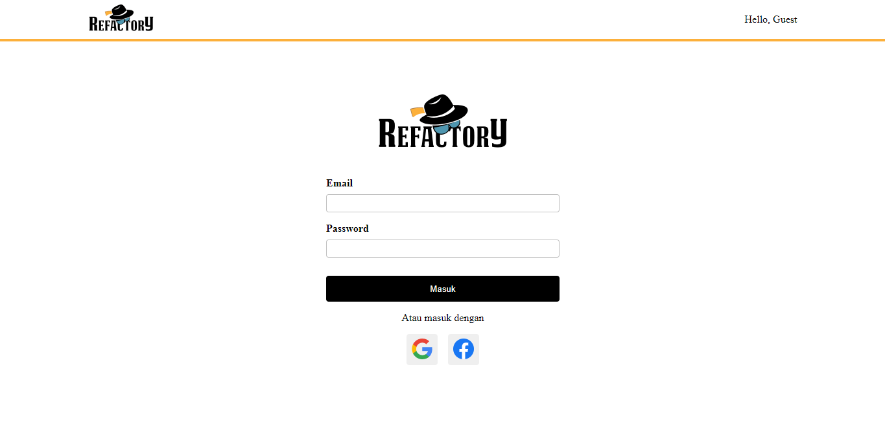

# Penjelasan Alur Aplikasi OAuth Google/Facebook

Pertama user mengunjungi halaman utama website, kemudian ketika user menekan tombol login menggunakan google/facebook maka aplikasi frontend akan mengirim request ke backend dengan endpoint berikut ('/auth/google'). kemudian service oauth dari google/facebook akan menampilkan halaman persetujuan.

Setelah user menerima persetujuan, service oauth dari google/facebook akan mengerimkan code authentikasi yang kemudian disimpan di cookie.

Kemudian dari backend akan mengirimkan clientId dan clientSecret ke oAuth google/facebook. Selanjutnya service google/facebook akan merespon dengan mengembalikan access token, refresh token dan data profile user yang login.

Backend kemudian menyimpan data profile user yang login ke database.

---

## Cara Instalasi Aplikasi OAuth
Berikut cara menjalankan aplikasi :
1. Jalankan perintah 'npm install' di folder frontend dan backend
2. Jalankan aplikasi backend dengan perintah berikut 'npm run start:dev'
3. Jalankan aplikasi frontend dengan perintah berikut 'npm start'
4. Buka browser melalui URI berikut : http://localhost:3000

---

## Screenshot Project

